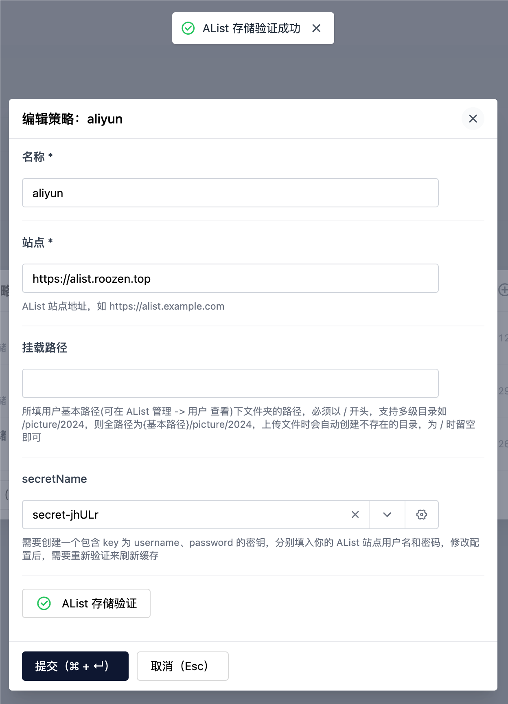

# plugin-alist

AList 存储库插件，支持创建 AList 类型的存储库

## 使用方式

首先[部署一个 AList 服务](https://alist.nn.ci/zh/guide/install/docker.html),进入后台管理，创建存储库

根据文档填写相关信息，注意这里的挂载路径

安装并启用此插件后，在 Halo 后台新建存储策略

选择 AList 存储

根据提示填写以下信息

注意：这里建议填写 `ADMIN` 用户的用户名和密码，因为部分 AList 接口只有 `ADMIN` 用户才能访问，否则将验证失败

如果你确信你的配置完全正确，并且你填写的非 `ADMIN` 用户至少拥有以下权限，尽管无法完成验证，但是并不影响使用


`ADMIN` 用户可以正常验证


## 注意事项
1. 插件需要依赖 AList 服务，请确保 AList 服务已经启动并配置正确
2. 如果存储验证成功但是`大文件`上传失败，可能是反向代理的配置有问题，对于 nginx 将下方配置加入你的nginx配置中
    ```
    client_body_buffer_size 512k;
    proxy_read_timeout 86400s;
    client_max_body_size 0;
    ```
   
3. 修改用户状态后需要重新验证来刷新缓存，如：修改用户密码
## 开发环境

插件开发的详细文档请查阅：<https://docs.halo.run/developer-guide/plugin/introduction>

所需环境：

1. Java 17
2. Node 18
3. pnpm 8
4. Docker (可选)

克隆项目：

```bash
git clone git@github.com:halo-sigs/plugin-alist.git

# 或者当你 fork 之后

git clone git@github.com:{your_github_id}/plugin-alist.git
```

```bash
cd path/to/plugin-alist
```

### 运行方式 1（推荐）

> 此方式需要本地安装 Docker

```bash
# macOS / Linux
./gradlew haloServer

# Windows
./gradlew.bat haloServer
```

执行此命令后，会自动创建一个 Halo 的 Docker
容器并加载当前的插件，更多文档可查阅：<https://docs.halo.run/developer-guide/plugin/basics/devtools>

### 运行方式 2

> 此方式需要使用源码运行 Halo

编译插件：

```bash
# macOS / Linux
./gradlew build

# Windows
./gradlew.bat build
```

修改 Halo 配置文件：

```yaml
halo:
    plugin:
        runtime-mode: development
        fixedPluginPath:
            - "/path/to/plugin-alist"
```

最后重启 Halo 项目即可。
